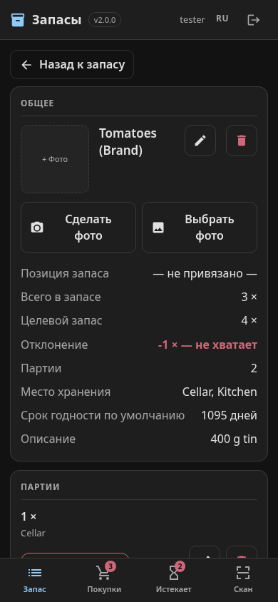

# inventree-pantry („Vorrat“)

Eine Vorrats-App fürs Handy auf Basis von [InvenTree](https://inventree.org): **einbuchen,
verbrauchen, zählen**. Dazu eine Einkaufsliste, die weiß, was fehlt, und eine Warnung, bevor
etwas abläuft. Wer den Barcode eines Supermarktprodukts scannt, bekommt das Produkt von selbst
angelegt: Name, Kategorie, Bild und ein Mindesthaltbarkeitsdatum kommen als Vorschlag von
[Open Food Facts](https://de.openfoodfacts.org).

English: [README.md](README.md)

> [!IMPORTANT]
> **Diese App ist „vibe-coded“.** Sie wurde fast vollständig von einem KI-Coding-Agenten
> (Claude Code) geschrieben, angeleitet von einer Person, für den Vorrat und Krisenvorrat
> eines Haushalts. Sie ist täglich im Einsatz, und jede Änderung wurde gegen ein echtes
> InvenTree geprüft. Ein Mensch hat den Code aber nicht Zeile für Zeile durchgesehen, wie man
> es bei handgeschriebener Software täte. Vor dem Einsatz lesen, und InvenTrees eigene
> Backups behalten.
>
> **Die Installationsanleitung ist dafür geschrieben, dass ein KI-Agent sie abarbeitet.** Gib
> deinem Agenten (Claude Code, Codex, Gemini CLI, …) die [INSTALL.md](INSTALL.md) und lass ihn
> machen. Er prüft jeden Schritt selbst und fragt dich an den Stellen, an denen die
> Entscheidung bei dir liegt. Von Hand geht es auch, die Anleitung ist dann eher gründlich als
> kurz.

<p>
  
  
  
  
</p>

## Warum

InvenTree ist eine hervorragende Lagerverwaltung, gebaut für Lager und Werkstatt. In der
Küche liegt in der offiziellen App jeder Alltagsschritt mehrere Bildschirme tief (Teil →
Lagerartikel → Anpassen). Diese App deckt die drei Dinge ab, die ein Haushalt wirklich tut, als
je einen Knopf, und überlässt alles andere InvenTrees eigener Oberfläche. InvenTree bleibt die
einzige Quelle der Wahrheit: Die App speichert nichts selbst, jede Aktion ist ein
dokumentierter API-Aufruf.

## Was hier drin ist

Nichts davon bringt InvenTree mit. Alles hier liegt in diesem Repository:

| Teil | Was er tut | Wo |
|---|---|---|
| **Die App** | Eine statische Seite (HTML + JavaScript, kein Build, kein CDN), ausgeliefert von InvenTrees eigenem Webserver unter `/vorrat/`. Lässt sich auf den Startbildschirm legen. | `app/` |
| **Open-Food-Facts-Plugin** | Ein InvenTree-Plugin. Einen noch unbekannten Barcode schlägt es bei Open Food Facts nach und legt das Produkt mit Kategorie, Schlagworten, MHD-Vorgabe, Packungsgröße und Foto an, der Barcode wird verknüpft. | `plugin/` |
| **Taxonomie-Skript** | Legt Kategorien, Lagerorte und den Packungsinhalt-Parameter aus `pantry.json` an. Beliebig oft ausführbar, löscht nie. | `tools/sync-taxonomy.py` |
| **Ablauf-Wächter** | Meldet täglich „3 abgelaufen, 2 bald“ an [ntfy](https://ntfy.sh) und/oder einen Matrix-Raum. | `tools/expiry-check.py`, `deploy/` |
| **Beispielkonfiguration** | Eine Start-Taxonomie für Vorrat und Krisenvorrat (BBK-Lebensmittelgruppen), in vier Sprachen. | `examples/pantry.*.json` |
| **Prüfungen** | Statische Prüfungen für App und Konfiguration, ein Browsertest gegen ein Fake-InvenTree. | `tools/` |

Nur die App ist Pflicht, der Rest ist optional.

## Funktionen

- **Bestand**: alles auf einen Blick, nach Lagerort oder Suche gefiltert, mit dem frühesten
  MHD je Artikel. Mehrere Chargen mit verschiedenen Daten pro Produkt.
- **Bedarf und Sorte**: „Reis“ ist, was man einkauft, und trägt den Soll-Bestand. Die Marken,
  die man tatsächlich kauft, hängen darunter und zählen zusammen. Zwei Marken Reis fehlen also
  gemeinsam oder gar nicht. Technisch sind das InvenTrees Vorlagen und Varianten.
- **Gezählt oder gemessen**: Ein Bedarf zählt Stück (30 Rollen) oder misst Kilogramm bzw.
  Liter (4 kg Reis). Eingebucht werden *Packungen*, die App rechnet mit der Packungsgröße um.
- **Einkaufsliste** mit allem unter Soll, über das Teilen-Menü des Handys verschickbar.
- **Läuft ab**, mit einer Vorwarnzeit, die sich nach der Haltbarkeit richtet: wenige Tage
  bei Frischmilch, drei Monate bei Konserven.
- **Scannen** mit der Handykamera: in Chrome auf Android von Haus aus, auf dem iPhone (Safari)
  mit dem optionalen Scanner aus `tools/fetch-scanner.sh`; ohne ihn Barcode eintippen. Ein
  unbekannter Barcode wird in einem Schritt zum neuen Produkt.
- **Fotos** aus Kamera oder Galerie, vor dem Hochladen verkleinert und gerade gedreht.
- **Einmal anmelden pro Gerät**, danach ein Jahr Ruhe (ein Token pro Gerät, in InvenTree
  widerrufbar).

## Sprachen

Deutsch, Englisch, Russisch und Chinesisch sind dabei. Die Seite folgt der Sprache des Handys,
oben rechts lässt sie sich umstellen. Datum, Zahlen und Mehrzahlformen kommen aus der
`Intl`-Unterstützung des Browsers. Russisch bekommt so seine drei Mehrzahlformen, und
chinesische Namen werden auch ohne Leerzeichen zwischen den Wörtern zugeordnet.

**Eine weitere Sprache?** Lass deinen KI-Agenten [TRANSLATING.md](TRANSLATING.md) abarbeiten.
Das ist eine JSON-Datei mit rund 190 Texten und zwei kleinen Einträgen, und
`tools/check-app.py` sagt dem Agenten (oder dir) genau, was noch fehlt. Die Übersetzungen hier
hat derselbe Agent angefertigt; Korrekturen von Muttersprachlern sind willkommen.

## Voraussetzungen

- **InvenTree 1.x** mit aktivierten Plugins (`INVENTREE_PLUGINS_ENABLED=True`). Getestet mit
  dem offiziellen Docker-Compose-Aufbau, InvenTree 1.4 (API-Version 511).
- Ein Weg, drei statische Dateien auf **InvenTrees eigenem Origin** auszuliefern. Beim Caddy
  aus InvenTrees Docker-Aufbau ist das eine Route (`deploy/Caddyfile.snippet`), nginx geht auch
  (`deploy/nginx.snippet`).
- **HTTPS** vor InvenTree, wenn Handys die Kamera nutzen sollen. Browser erlauben die Kamera
  nur auf sicheren Origins.
- Für den Ablauf-Wächter: Python 3.9+ auf einem Rechner, der InvenTree erreicht.

## Installation

→ **[INSTALL.md](INSTALL.md)** (englisch), am besten von deinem KI-Agenten ausgeführt. In
Kürze: eine `pantry.json` aus einem der Beispiele anlegen, `tools/install.sh
<inventree-datenverzeichnis> pantry.json` ausführen, eine Caddy-Route und ein Volume ergänzen,
neu starten, das Plugin aktivieren, das Taxonomie-Skript laufen lassen und InvenTrees
MHD-Verwaltung einschalten.

Jeder Schlüssel der Konfigurationsdatei ist in [docs/configuration.md](docs/configuration.md)
beschrieben, die Gründe hinter dem Aufbau stehen in [docs/design.md](docs/design.md): warum eine
einzige Seite, warum derselbe Origin, warum der Kategoriebaum nur eine Dimension trägt.

## Entwicklung

```sh
python3 tools/check-app.py                      # App: Skript-Integrität + alle Sprachen
python3 tools/check-config.py examples/*.json   # die Beispielkonfigurationen
npm install --no-save playwright && npx playwright install chromium
node tools/smoke-test.cjs --shots /tmp/shots    # jeder Bildschirm, jede Sprache, Fake-API
```

KI-Agenten, die am Code arbeiten: zuerst [AGENTS.md](AGENTS.md) lesen.

## Lizenz und Dank

MIT, siehe [LICENSE](LICENSE).

Ein unabhängiges Projekt, weder mit InvenTree noch mit Open Food Facts verbunden.
[InvenTree](https://github.com/inventree/InvenTree) steht unter MIT. Die Produktdaten, die das
Plugin nachschlägt, stammen von [Open Food Facts](https://de.openfoodfacts.org) und stehen unter
der [Open Database License](https://opendatacommons.org/licenses/odbl/1-0/), Produktfotos unter
[CC BY-SA](https://creativecommons.org/licenses/by-sa/3.0/deed.de). Wer damit aufgebaute Daten
veröffentlicht, nennt Open Food Facts entsprechend. Die Icons sind Pfade aus den
[Material Design Icons](https://fonts.google.com/icons) (Apache 2.0). Der optionale iPhone-Scanner,
den `tools/fetch-scanner.sh` holt, ist [barcode-detector](https://github.com/Sec-ant/barcode-detector)
und [zxing-wasm](https://github.com/Sec-ant/zxing-wasm) (MIT) auf Basis von
[ZXing-C++](https://github.com/zxing-cpp/zxing-cpp) (Apache 2.0); er ist nicht Teil dieses Repositorys.
