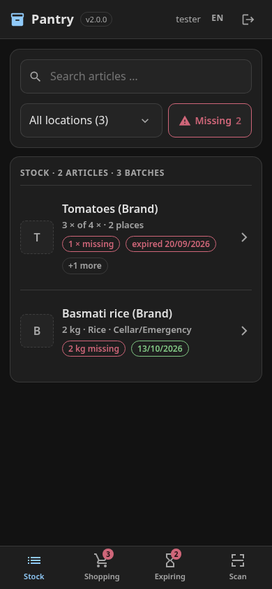
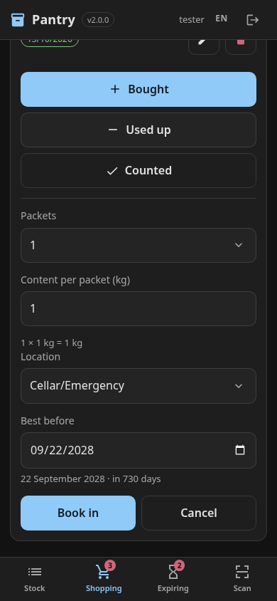
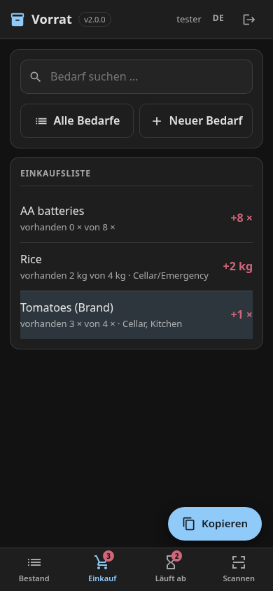
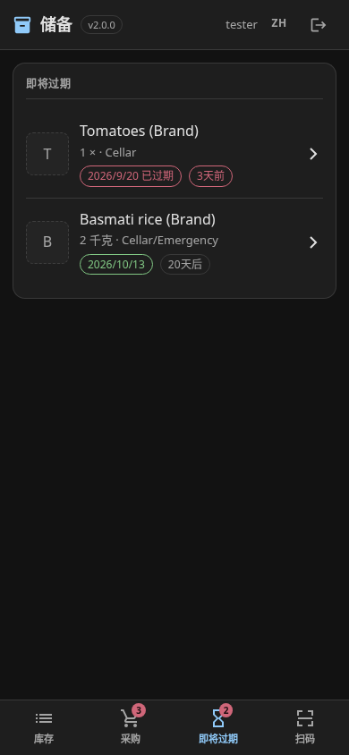

# inventree-pantry

A phone-sized pantry app on top of [InvenTree](https://inventree.org): **book in, use up,
count**, a shopping list that knows what is missing, and a warning before things expire.
Scanning a supermarket barcode files the product by itself, with name, category, picture and a
best-before date suggested by [Open Food Facts](https://world.openfoodfacts.org).

Deutsch: [README.de.md](README.de.md)

> [!IMPORTANT]
> **This app is vibe-coded.** It was written almost entirely by an AI coding agent
> (Claude Code), directed by one person, for one household's pantry and emergency supply. It
> is in daily use and every change was checked against a real InvenTree, but no human has
> reviewed the code line by line the way hand-written software would be reviewed. Read before
> you run it, and keep InvenTree's own backups.
>
> **The installation guide is written for an AI agent to carry out.** Point your agent
> (Claude Code, Codex, Gemini CLI, …) at [INSTALL.md](INSTALL.md) and let it do the work. It
> checks its own steps and stops to ask you where a decision is yours. You can follow it by
> hand too, but it is thorough rather than short.

<p>
  
  
  
  
</p>

## Why

InvenTree is excellent inventory software, built for warehouses and workshops. In a kitchen,
its official app puts every everyday action several screens deep (Part → Stock Item →
Adjust). This app covers the three things a household actually does, each as one button, and
leaves everything else to InvenTree's own interface. InvenTree stays the single source of
truth: the app stores nothing of its own and every action is one documented API call.

## What is in here

InvenTree does not ship any of this. Everything below is in this repository:

| Part | What it does | Where |
|---|---|---|
| **The app** | One static page (HTML + JavaScript, no build step, no CDN) served by InvenTree's own web server at `/vorrat/`. Installable on the home screen. | `app/` |
| **Open Food Facts plugin** | An InvenTree plugin. A barcode nobody knows yet is looked up at Open Food Facts; the product is created with category, keywords, default best-before period, pack size and photo, and the barcode is linked to it. | `plugin/` |
| **Taxonomy script** | Creates your categories, storage locations and the pack-size parameter from `pantry.json`. Safe to rerun; never deletes. | `tools/sync-taxonomy.py` |
| **Expiry watchdog** | A daily job that pushes "3 expired, 2 expiring soon" to [ntfy](https://ntfy.sh) and/or a Matrix room. | `tools/expiry-check.py`, `deploy/` |
| **Example configuration** | A starter taxonomy for a household pantry and emergency supply, in four languages. | `examples/pantry.*.json` |
| **Checks** | Static checks for the app and the configuration, and a browser smoke test against a fake InvenTree. | `tools/` |

Only the app is required; the other parts are optional.

## Features

- **Stock**: everything at a glance, filtered by place or search, with the earliest
  best-before date of each article. Several batches with different dates per product.
- **Staples and brands**: "Rice" is what you shop for and carries the target stock. The
  brands you actually buy hang underneath it and add up, so two brands of rice are short
  together or not at all. This uses InvenTree's template/variant parts.
- **Counted or measured**: a staple counts pieces (30 rolls) or measures kilograms/litres
  (4 kg of rice). You book in *packets*; the app multiplies by the pack size.
- **Shopping list** of everything below target, shareable through the phone's share sheet.
- **Expiring soon**, with a warning window that scales with shelf life: a few days for
  fresh milk, three months for tins.
- **Scanning** with the phone camera: natively in Chrome on Android, and on iPhones (Safari)
  with the optional scanner from `tools/fetch-scanner.sh`; without it, type the barcode in. An
  unknown barcode becomes a new product in one step.
- **Photos** from the camera or the gallery, shrunk and straightened before upload.
- **One login per device**, then a year of silence (a per-device API token that can be
  revoked in InvenTree).

## Languages

German, English, Russian and Chinese ship with the app. The page follows the phone's language
and has a picker in the header. Dates, numbers and plurals are formatted with the browser's
own `Intl` support, so Russian gets its three plural forms and Chinese is matched without
spaces between words.

**Another language?** Ask your AI agent to follow [TRANSLATING.md](TRANSLATING.md). It is one
JSON file of about 190 strings plus two small lines of registration, and
`tools/check-app.py` tells the agent (or you) exactly what is still missing. The machine
translations here were made by the same agent; corrections from native speakers are welcome.

## Requirements

- **InvenTree 1.x** with plugins enabled (`INVENTREE_PLUGINS_ENABLED=True`). Tested with the
  official Docker Compose setup, InvenTree 1.4 (API version 511).
- A way to serve three static files on **InvenTree's own origin**: the Caddy that comes with
  InvenTree's Docker setup does it with one route (`deploy/Caddyfile.snippet`); nginx works
  too (`deploy/nginx.snippet`).
- **HTTPS** in front of InvenTree, if phones should use the camera. Browsers only allow the
  camera on secure origins.
- For the expiry watchdog: Python 3.9+ anywhere that can reach InvenTree.

## Install

→ **[INSTALL.md](INSTALL.md)**, ideally carried out by your AI agent. In short: create a
`pantry.json` from one of the examples, run `tools/install.sh <inventree-data-dir>
pantry.json`, add one Caddy route and one volume, restart, activate the plugin, run the
taxonomy script, and switch on InvenTree's expiry tracking.

The configuration file is described key by key in
[docs/configuration.md](docs/configuration.md). The reasons behind the design (why one page,
why same origin, why the category tree carries only one dimension) are in
[docs/design.md](docs/design.md).

## Development

```sh
python3 tools/check-app.py                      # the app: script integrity + every language
python3 tools/check-config.py examples/*.json   # the example configurations
npm install --no-save playwright && npx playwright install chromium
node tools/smoke-test.cjs --shots /tmp/shots    # every screen, every language, fake API
```

AI agents working on the code: read [AGENTS.md](AGENTS.md) first.

## License and credits

MIT, see [LICENSE](LICENSE).

This is an independent project and not affiliated with InvenTree or Open Food Facts.
[InvenTree](https://github.com/inventree/InvenTree) is MIT-licensed. Product data looked up by
the plugin comes from [Open Food Facts](https://world.openfoodfacts.org), available under the
[Open Database License](https://opendatacommons.org/licenses/odbl/1-0/); product photos are
under [CC BY-SA](https://creativecommons.org/licenses/by-sa/3.0/). If you publish data you
built with it, attribute Open Food Facts accordingly. The icons are paths from
[Material Design Icons](https://fonts.google.com/icons) (Apache 2.0). The optional iPhone scanner
fetched by `tools/fetch-scanner.sh` is [barcode-detector](https://github.com/Sec-ant/barcode-detector)
and [zxing-wasm](https://github.com/Sec-ant/zxing-wasm) (MIT), built on
[ZXing-C++](https://github.com/zxing-cpp/zxing-cpp) (Apache 2.0); it is not part of this repository.
